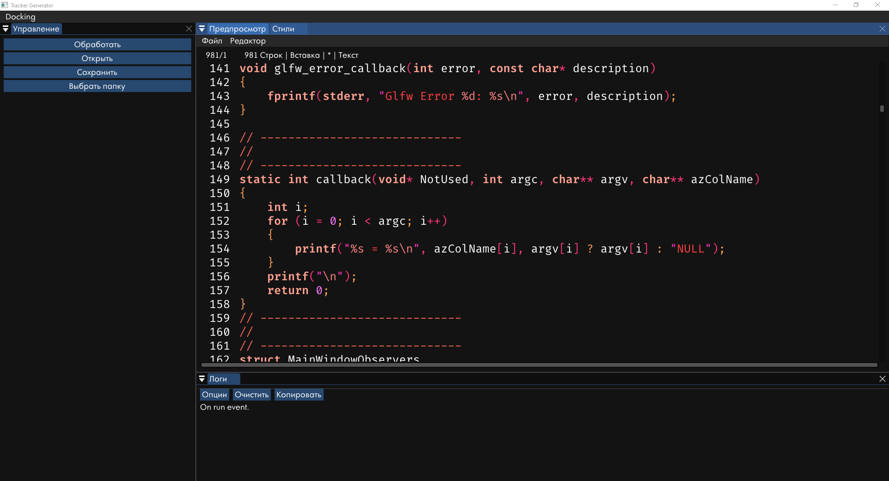

##ImGui based text editor with syntax highlighring##
It based on [colorer projec](http://colorer.sourceforge.net/ "colorer project") by Igor Russkih. 
#Supported languages#
c, cpp, asm, perl, java, idl, pascal, csharp, jsnet, vbnet, forth, fortran, vbasic, html, css, htm, l-css, svg-css, jsp, php, xhtml-trans, xhtml-strict, xhtml-frameset, asp.vb, asp.js, asp.ps, adp, svg, coldfusion, jScript, actionscript, vbScript, xml, dtd, xslt, xslt2, xquery, xmlschema, relaxng, wsdl, clarion, Clipper, foxpro, sqlj, paradox, sql, mysql, bootini, msdossys, configsys, reg, ini, Batch, apache, shell, avisynth, config, ent.hrc, hrc, hrd, bkt, colorer5catalog, xsd2hrc.custom, delphiform, pnuts, javacc, javaProperties, javapolicy, lex, yacc, makefile, resources, rtf, TeX, dcl, vrml, rarscript, nsi, iss, isScripts, c1c, ada, abap4, AutoIt, awk, dssp, adsp, Baan, cobol, cache, eiffel, icon, lisp, matlab, modula2, picasm, python, rexx, ruby, sml, ocaml, tcltk, sicstusProlog, turboProlog, verilog, vhdl, ahdl, z80, asm80, a51, avr, ftn, email, pms, farmailmsg, filesbbs, diff, text, default, csql, cppsql, cobolsql, farhelp, farlng, farmenu, farmailscript, far.macro, tgs, truemac, calcset, xslfo, docboo, mathml, wml, web-app, taglib, parser, wsc, wsf, rdf, rss, htc, xbl, ant, xsieve, litestep_steprc, dii, atl, rpt, adi, tor, ass, mason, pagemakerscript, postscript, lss, kixtart, pvwave, mntrackscript, sl, rib, mel3dmax, ppWizard, RSMac, adm, linkdef, flex, gpss, sdml, irclog, micqlog, mancolorer, urq, vismo, m4, edif, vim

Project is in development stage.